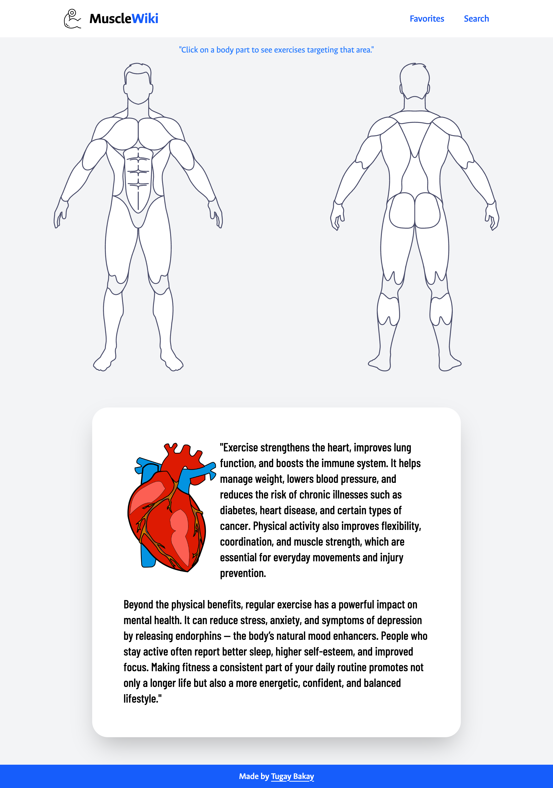
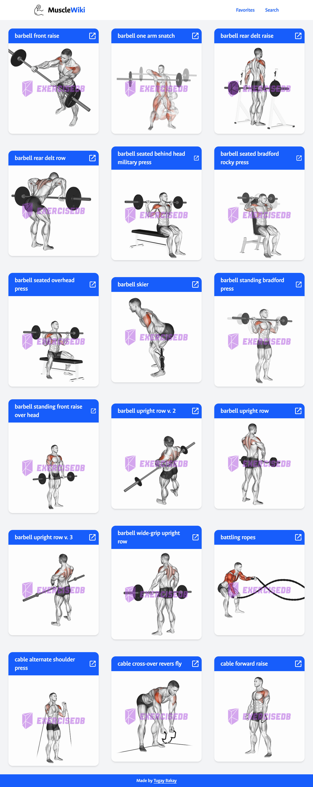
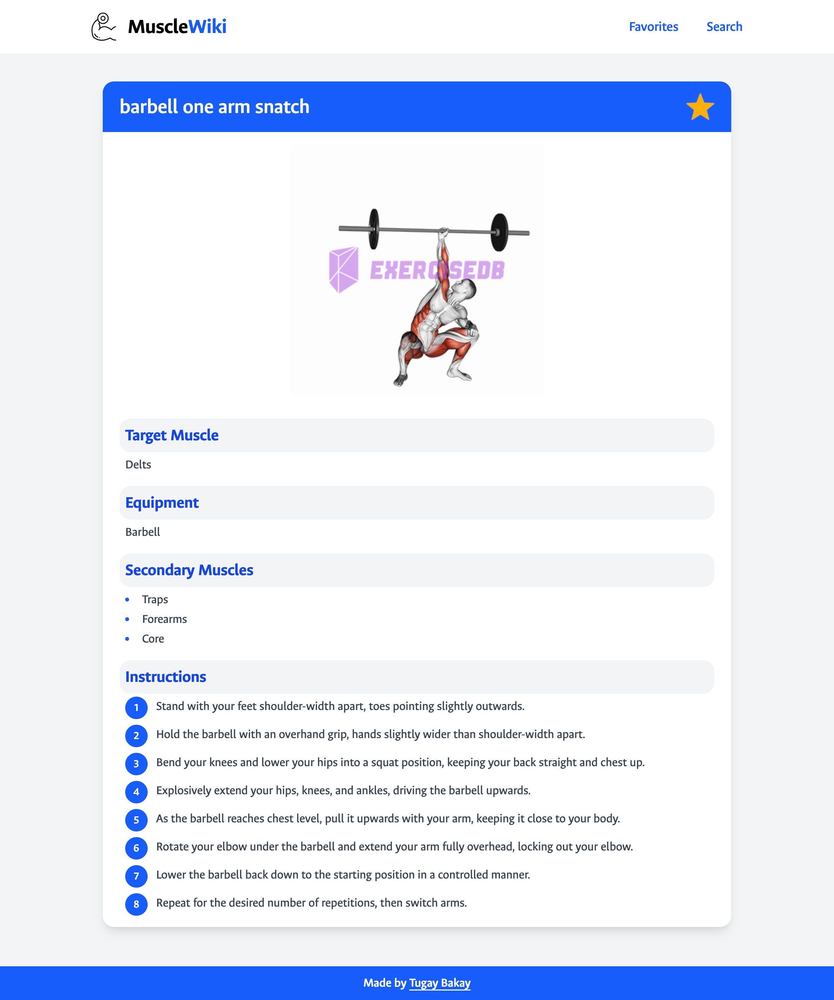
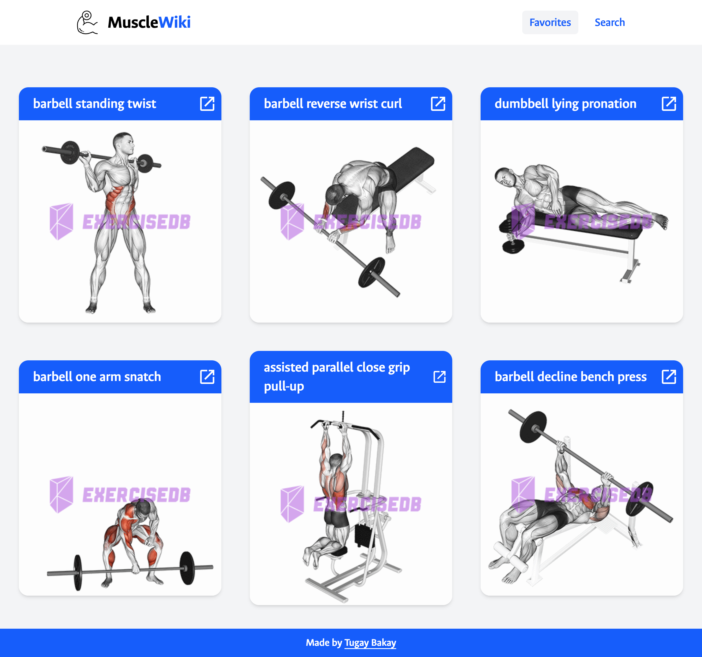
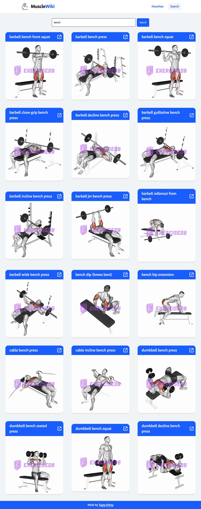
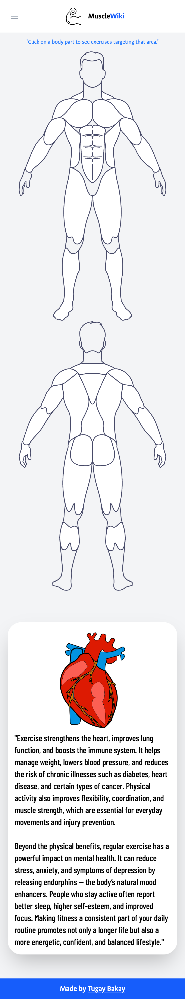

# 🏋️ Muscle Wiki

[Click here to view the app](https://muscle-wiki.vercel.app/)

A responsive and interactive exercise browser built with **React.js** and **Vite**. The app allows users to discover exercises by body part, search functionality, and view detailed exercise information. Users can also save favorite exercises using `localStorage`.



## 🚀 Features

- Browse exercises by **body part**
- Search functionality with **Formik + Yup** validation
- View **exercise details** including muscle targets and equipment
- **Favorites** feature stored in localStorage
- Fully **responsive design** with Tailwind CSS
- **Pagination** via React Router DOM
- Optimized data fetching with **Axios** and **React Query**
- Screens include:
  - Home
  - Exercises
  - Exercise Details
  - Favorites
  - Search

## 🧰 Tech Stack

| Tech              | Usage                                      |
|------------------|--------------------------------------------|
| [React.js](https://reactjs.org/)          | Frontend library                     |
| [Vite](https://vitejs.dev/)              | Build tool for fast development     |
| [Tailwind CSS](https://tailwindcss.com/) | Utility-first CSS framework         |
| [React Router DOM](https://reactrouter.com/) | Client-side routing & pagination |
| [Axios](https://axios-http.com/)         | API requests                         |
| [React Query](https://tanstack.com/query) | Caching and data synchronization    |
| [Formik + Yup](https://formik.org/)      | Form management and validation       |

## 🔗 API

Exercise data is fetched from the following endpoint using [RapidAPI](https://rapidapi.com/justin-WFnsXH_t6/api/exercisedb/playground/apiendpoint_e2873f78-665e-4c93-aa58-0ff031db6261):

```
https://exercisedb.p.rapidapi.com
```

### API Response Structure:

```js
/**
 * @typedef {Object} Exercise
 * @property {string} id
 * @property {string} name
 * @property {string} bodyPart
 * @property {string} equipment
 * @property {string} gifUrl
 * @property {string} target
 */
```

## 📸 Screenshots

| Page              | Preview                              |
|------------------|--------------------------------------|
| Home             |  |
| Exercises        |  |
| Exercise Details |  |
| Favorites        |  |
| Search           |  |
| Responsive Design|  |

## 📦 LocalStorage

User favorites are stored persistently using `localStorage` for a better user experience across sessions.

## 🔍 Search Page

The search form is enhanced with **Formik** and **Yup** for effective form handling and validation, providing smoother UX.
